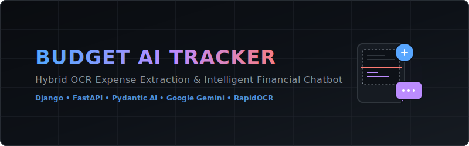
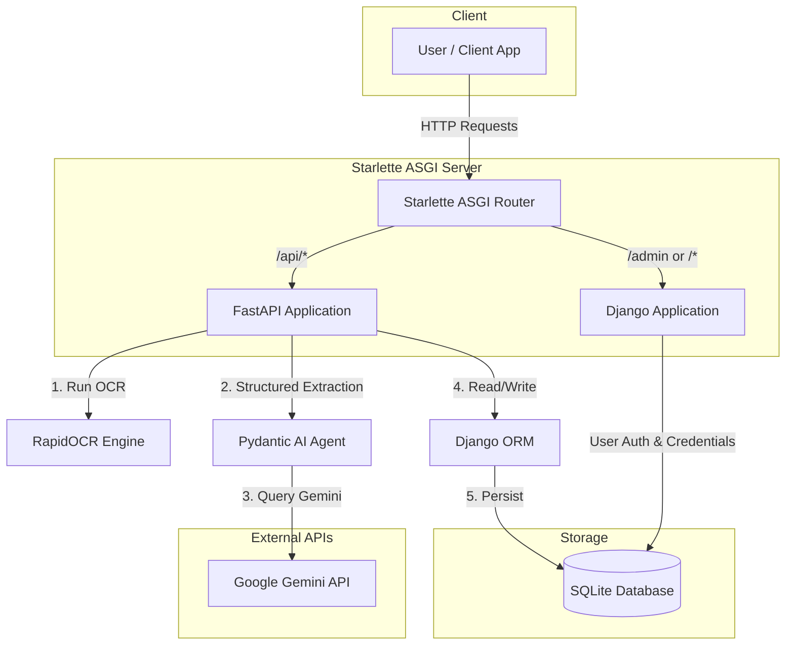

<p align="center">
  
</p>

<p align="center">
  <a href="https://www.python.org/"></a>
  <a href="https://www.djangoproject.com/"></a>
  <a href="https://fastapi.tiangolo.com/"></a>
  <a href="https://ai.pydantic.dev/"></a>
  <a href="https://github.com/RapidAI/RapidOCR"></a>
  <a href="LICENSE"></a>
</p>

An intelligent, hybrid budget and transaction extraction application. It captures transaction screenshots, runs a local OCR engine to extract raw text, normalizes and extracts structured transaction records using Pydantic AI with Google Gemini, stores them securely in a Django database, and offers a FastAPI-powered chatbot assistant for natural language financial insights—complete with dynamic Mermaid chart rendering!

---

## 🚀 Key Features

*   📸 **Local RapidOCR Processing** – Local OCR engine reads receipt/transaction screenshots instantly without sending raw images to external API providers.
*   🤖 **Gemini-Powered Pydantic AI Agent** – Uses `pydantic-ai` with `google:gemini-flash-lite-latest` to parse unstructured OCR text into high-fidelity, structured JSON matching a Pydantic schema.
*   🔒 **Fernet-Encrypted Credentials** – Securely encrypts user-provided Gemini/LLM API keys at rest in SQLite using symmetric Fernet encryption, dynamically bound to Django's `SECRET_KEY`.
*   💬 **AI Financial Assistant (Chatbot)** – A conversation agent that answers user queries (e.g., *"How much did I spend at Starbucks?"*) utilizing the user's latest transaction database state as context.
*   📊 **Dynamic Mermaid Charts** – The chatbot utilizes specialized tools to return interactive Mermaid code blocks:
    *   `generate_spending_histogram` – Generates a bar chart distribution of transaction amounts.
    *   `generate_data_schema_diagram` – Generates a class diagram of the underlying database models.
*   ⚡ **Unified Starlette ASGI Stack** – Mounts Django (handling user authentication, ORM models, and Django Admin) and FastAPI (handling fast AI queries and image upload streams) under a unified Starlette application server.

---

## 📐 System Architecture & Data Flow

Below is the layout of the hybrid architecture. The client interacts with the unified ASGI server, routing administrative and database tasks to Django, and real-time AI/OCR logic to FastAPI.



### 📥 Transaction Upload & Processing Pipeline

1.  **Upload**: The user uploads a receipt image (e.g. UPI transaction screenshot) via `/api/transactions/upload`.
2.  **OCR Extraction**: `RapidOCR` runs locally to scan the image and convert it into raw string tokens.
3.  **LLM Structuring**: The raw text tokens are fed into a Pydantic AI agent configured with a strict `TransactionData` schema.
4.  **Parsing & Validation**: Google Gemini parses the text, extracts transaction metadata (status, amount, sender/receiver UPI IDs, bank, UTR, timestamp), and validates it using Pydantic.
5.  **Storage**: The structured transaction is appended to the user's database bucket.

---

## 🛠️ Tech Stack & Dependencies

*   **Backend Core**: Python 3.11+
*   **Web Frameworks**: FastAPI (for AI and OCR services) & Django (for auth, admin, and ORM).
*   **Routing & Serving**: Starlette & Uvicorn (ASGI server).
*   **AI & Agents**: Pydantic AI (`pydantic-ai`) & Google Generative AI (`google-generativeai`).
*   **OCR**: `rapidocr-onnxruntime` (local OCR processor).
*   **Security**: Cryptography (Fernet symmetric encryption).
*   **Database**: SQLite3 (default, configurable to PostgreSQL/MySQL via Django settings).

---

## ⚙️ Setup & Installation

### 1. Clone the Repository
```bash
git clone https://github.com/pawan941394/budget-ai-tracker.git
cd budget-ai-tracker
```

### 2. Set Up Virtual Environment
It is recommended to use `uv` (a fast Python package installer) or standard `venv`:

**Using `uv`:**
```powershell
uv venv
.venv\Scripts\activate
uv pip install -r requirements.txt
```

**Using standard `pip`:**
```powershell
python -m venv .venv
.venv\Scripts\activate
pip install -r requirements.txt
```

### 3. Configure Environment Variables
Create a `.env` file in the root directory:
```env
# Google Gemini API key used by the application
GOOGLE_API_KEY=your_gemini_api_key_here
```

### 4. Run Migrations & Setup Database
Initialize your Django database models and create a superuser for the admin portal:
```bash
# Navigate to the budget_app directory
cd budget_app

# Run migrations
python manage.py migrate

# Create superuser for Django Admin
python manage.py createsuperuser
```

### 5. Launch the Server
Start the unified Starlette application server using Uvicorn:
```bash
python -m uvicorn budget_app.asgi:application --reload --port 8000
```
Your server will be running at `http://127.0.0.1:8000`.
*   **FastAPI API Docs**: `http://127.0.0.1:8000/api/docs` (Swagger UI)
*   **Django Admin**: `http://127.0.0.1:8000/admin`
*   **Healthcheck**: `http://127.0.0.1:8000/health`

---

## 🔌 API Endpoint Reference

All FastAPI endpoints are prefixed with `/api` and are documented in detail via Swagger UI.

### 👤 User Management (`/api/users`)
| Method | Endpoint | Description | Request Body |
| :--- | :--- | :--- | :--- |
| **POST** | `/register` | Register a new user with a phone number and password. | `{ "phone_number": "...", "password": "..." }` |

### 🔑 LLM API Key Management (`/api/llm-api-keys`)
*Keys are automatically encrypted before saving to the database using Fernet symmetric encryption.*
| Method | Endpoint | Description | Request Body |
| :--- | :--- | :--- | :--- |
| **POST** | `/upsert` | Save or update a user's Gemini API key. | `{ "phone_number": "...", "provider": "openai/google", "api_key": "..." }` |
| **GET** | `/{phone_number}` | Retrieve LLM API key status (checks if active and hashed). | *None* |

### 📸 Transaction Operations (`/api/transactions`)
| Method | Endpoint | Description | Request Body / Parameters |
| :--- | :--- | :--- | :--- |
| **POST** | `/upload` | Upload a transaction screenshot. Automatically triggers local RapidOCR and extracts data using Gemini. | Form-data: `phone_number` (string) & `image` (file) |
| **POST** | `/upsert` | Manually insert or update a transaction record. | `{ "phone_number": "...", "transaction": { ... } }` |
| **GET** | `/{phone_number}` | Retrieve all transaction records stored for a specific user. | *None* |

### 💬 Chatbot Assistant (`/api/chat`)
| Method | Endpoint | Description | Request Body |
| :--- | :--- | :--- | :--- |
| **POST** | `/` | Interact with the AI assistant. Incorporates user transactions and chat history automatically. | `{ "phone_number": "...", "message": "...", "session_id": "..." }` |
| **GET** | `/history/{phone_number}` | Retrieve chat session history for a user. | *None* |

---

## 🤖 AI Assistant Tools (Agent Capabilities)

The Pydantic AI chatbot uses the following built-in tools dynamically based on user prompts:

1.  **`get_recent_transactions`** – Retrieves the user's latest transaction logs.
2.  **`grep_transaction_data`** – Searches raw transactions using a text query.
3.  **`generate_spending_histogram`** – Aggregates transaction amounts into bins and responds with a beautiful **Mermaid XYChart-Beta** diagram representing spending frequency.
4.  **`generate_data_schema_diagram`** – Responds with a **Mermaid Class Diagram** detailing the transaction data structures.
5.  **`current_date_and_time`** – Computes the current date/time to resolve temporal queries like *"Show me transactions from this week"*.

---

## 🔒 Security Architecture

The application implements symmetric encryption to safeguard sensitive API keys in public databases:
*   **Fernet Encryption**: Before any `Llmapikey` record is saved, the API key string is encrypted using cryptography's `Fernet` module.
*   **Key Derivation**: The encryption key is derived by running a SHA-256 hash on Django's secret `SECRET_KEY`.
*   **Decryption**: When a user uploads a transaction or chats with the assistant, the backend decrypts the API key in-memory to execute the request, ensuring the plain-text key is never written to disk or exposed in database dumps.

---

## ⬆️ How to Upload this Project to GitHub

Ready to publish? Follow these simple commands to upload this repository to your GitHub account:

### Step 1: Initialize Git & Stage Files
*(Run these commands from the project root directory)*
```bash
# Initialize a local Git repository (if not already initialized)
git init

# Stage all files (this respects your .gitignore settings)
git add .

# Create your initial commit
git commit -m "feat: initial commit of Hybrid OCR Transaction Extractor & Budget App"
```

### Step 2: Create a Repository on GitHub
1. Go to [GitHub](https://github.com/) and click **New Repository**.
2. Name your repository `budget-ai-tracker`.
3. Leave it public/private, and do **NOT** initialize it with a README, `.gitignore`, or License (as we have already created them).
4. Click **Create Repository**.

### Step 3: Link and Push
Copy the Git URL of your repository and run the following in your terminal:
```bash
# Rename the default branch to main
git branch -M main

# Link your local repository to GitHub
git remote add origin https://github.com/pawan941394/budget-ai-tracker.git

# Push your code to GitHub
git push -u origin main
```

---

## 📝 License
This project is licensed under the MIT License. See the [LICENSE](LICENSE) file for details.

---
*Created by [Pawan](https://github.com/pawan941394) - Feel free to star the repo ⭐️ if you find this project useful!*
